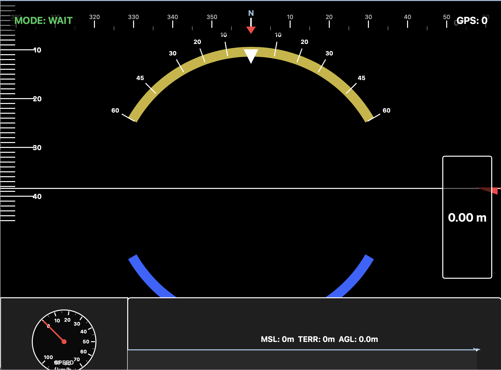

# TelemetryHUD - Native macOS Application

A fully native macOS application written in Swift for real-time ArduPilot telemetry visualization. This application provides a comprehensive HUD (Heads-Up Display) interface showing aircraft attitude, GPS data, speed, altitude, and terrain information.



## Features

- **Native macOS App**: Built with SwiftUI and Swift, fully compiled macOS application
- **Real-time 3D Attitude Display**: Horizon indicator with roll, pitch, and yaw visualization
- **Compass Tape**: Heading indicator at the top of the screen
- **Pitch Ladder**: Visual pitch angle reference lines
- **Roll Indicator**: Arc display showing aircraft roll angle
- **Analog Speedometer**: Circular gauge showing ground speed (km/h)
- **Terrain Profile**: Real-time graph showing aircraft altitude vs. terrain elevation
- **GPS Information**: Satellite count and GPS fix status
- **Flight Mode Display**: Current ArduPilot flight mode
- **Altitude Display**: Barometric altitude reading
- **USB Serial Communication**: Direct communication with RadioMaster TX12 via USB

## Requirements

- **macOS 13.0 (Ventura) or later**
- **Xcode 14.0 or later** (for building from source)
- **USB connection** to your RadioMaster TX12 (or compatible radio)
- **Internet connection** (for terrain elevation data from Open-Meteo API)

## Building the Application

### Method 1: Build with Xcode (Recommended)

1. **Open the project in Xcode:**
   ```bash
   git clone git@github.com:comsompom/tx12_telemetry_visual.git
   cd tx12_telemetry_visual
   open TelemetryHUD.xcodeproj
   ```

2. **Select the build target:**
   - Choose "My Mac" as the destination
   - Select "TelemetryHUD" scheme

3. **Build the project:**
   - Press `Cmd + B` to build
   - Or go to **Product > Build**

4. **Run the application:**
   - Press `Cmd + R` to run
   - Or go to **Product > Run**

5. **Create a distributable app:**
   - Go to **Product > Archive**
   - Once archived, click **Distribute App**
   - Choose **Copy App** to create a standalone `.app` bundle

### Method 2: Build from Command Line

```bash
git clone git@github.com:comsompom/tx12_telemetry_visual.git
cd tx12_telemetry_visual
xcodebuild -project TelemetryHUD.xcodeproj -scheme TelemetryHUD -configuration Release
```

The built app will be in:
```
build/Release/TelemetryHUD.app
```

## Project Structure

```
tx12_telemetry_visual/
├── TelemetryHUD.xcodeproj/     # Xcode project file
│   └── project.pbxproj
├── TelemetryHUD/                # Source code
│   ├── TelemetryHUDApp.swift   # Main app entry point
│   ├── Models/                  # Data models
│   │   ├── TelemetryData.swift
│   │   └── TelemetryViewModel.swift
│   ├── Views/                   # SwiftUI views
│   │   ├── HUDView.swift
│   │   ├── HorizonView.swift
│   │   ├── PitchLadderView.swift
│   │   ├── RollIndicatorView.swift
│   │   ├── CompassTapeView.swift
│   │   ├── SpeedometerView.swift
│   │   └── TerrainProfileView.swift
│   ├── Services/                # Services
│   │   ├── SerialPortManager.swift
│   │   └── TerrainService.swift
│   └── Info.plist              # App configuration
└── README.md                   # This file
```

## Usage

### First Launch

1. **Connect your RadioMaster TX12** to your Mac via USB

2. **Configure your radio:**
   - Set USB mode to "Serial" or "VCP" (Virtual COM Port)
   - Enable telemetry forwarding to USB (varies by firmware)

3. **Launch the application:**
   - Double-click `TelemetryHUD.app`
   - Or run from Xcode

4. **Select USB port:**
   - The app will show a port selection dialog
   - Choose your USB serial port (typically `/dev/cu.usbmodem*`)
   - Click "Connect"

5. **View telemetry:**
   - The HUD will display real-time telemetry data
   - All displays update automatically as data arrives

### Finding Your USB Port

If you need to find your USB port manually:

```bash
# List all USB serial ports
ls /dev/cu.*

# Common patterns:
# /dev/cu.usbmodem*     (USB modem devices)
# /dev/cu.usbserial*    (USB serial adapters)
# /dev/tty.usbmodem*    (alternative naming)
```

## How It Works

### Architecture

The application uses a multi-layered architecture:

1. **SerialPortManager**: Handles low-level USB serial communication using Darwin/IOKit
2. **TelemetryParser**: Parses binary telemetry packets from the radio
3. **TelemetryViewModel**: Manages telemetry state and coordinates updates
4. **TerrainService**: Fetches terrain elevation data from Open-Meteo API
5. **SwiftUI Views**: Render the HUD visualization components

### Data Flow

```
USB Serial Port
    ↓
SerialPortManager (reads bytes)
    ↓
TelemetryParser (parses packets)
    ↓
TelemetryViewModel (manages state)
    ↓
SwiftUI Views (render HUD)
```

### Packet Protocol

The application expects binary packets with the following structure:
- **Start bytes**: `0xEA` or `0xC8`
- **Length byte**: Packet length (2-64 bytes)
- **Type byte**: Packet type identifier
- **Payload**: Data bytes
- **Checksum**: Last byte (not currently validated)

**Packet Types:**
- `0x02`: GPS data (latitude, longitude, ground speed, satellites)
- `0x07`: Vertical speed
- `0x09`: Barometric altitude
- `0x1E`: Attitude data (pitch, roll, yaw)
- `0x21`: Flight mode string

### Coordinate Systems

- **Attitude**: Roll, pitch, yaw in degrees (converted from radians)
- **GPS**: Latitude/longitude in decimal degrees (scaled from 1e7)
- **Altitude**: Barometric altitude in meters (offset by 10000)
- **Speed**: Ground speed in km/h (scaled from 0.1 km/h units)

## Troubleshooting

### "Failed to open" error

- **Check USB connection**: Ensure the radio is properly connected
- **Verify port name**: The port selection dialog should list available ports
- **Check permissions**: You may need to grant Terminal/Xcode permission to access USB devices
  - Go to **System Settings > Privacy & Security > Full Disk Access**
  - Add Terminal or Xcode if needed
- **Port in use**: Make sure no other application is using the serial port

### No data appearing

- **Check radio settings**: Ensure telemetry forwarding is enabled
- **Verify baud rate**: Default is 115200, may need adjustment in code
- **Check packet format**: Ensure your radio outputs the expected packet format
- **Check console**: Look for error messages in Xcode console

### Terrain data not loading

- **Internet connection**: Requires active internet for elevation API
- **GPS fix**: Terrain data only loads when GPS has a fix (4+ satellites)
- **API rate limiting**: Open-Meteo API is throttled to 2-second intervals

### Build errors

- **Xcode version**: Ensure you have Xcode 14.0 or later
- **macOS version**: Requires macOS 13.0 or later
- **Swift version**: Requires Swift 5.0 or later
- **Clean build**: Try **Product > Clean Build Folder** (Shift+Cmd+K)

### Performance issues

- **Reduce update rate**: Modify timer intervals in `TelemetryViewModel.swift`
- **Close other applications**: Free up system resources
- **Check CPU usage**: Monitor Activity Monitor for resource usage

## Code Customization

### Changing Baud Rate

Edit `SerialPortManager.swift`:
```swift
serialManager.connect(to: selectedPort, baudRate: 115200) // Change this value
```

### Adjusting Update Rates

Edit `TelemetryViewModel.swift`:
```swift
// Telemetry update rate (30 Hz)
updateTimer = Timer.scheduledTimer(withTimeInterval: 1.0/30.0, ...)

// Terrain update rate (2 seconds)
terrainTimer = Timer.scheduledTimer(withTimeInterval: 2.0, ...)
```

### Modifying Display Colors

Edit individual view files (e.g., `HorizonView.swift`):
```swift
Color(red: 0.627, green: 0.745, blue: 0.882) // Sky blue
Color(red: 0.510, green: 0.392, blue: 0.275)  // Ground brown
```

## Distribution

### Creating a Standalone App

1. **Archive the app:**
   - In Xcode: **Product > Archive**
   - Wait for the archive to complete

2. **Export the app:**
   - Click **Distribute App**
   - Choose **Copy App**
   - Select destination folder
   - The `.app` bundle can be distributed

### Code Signing (Optional)

For distribution outside the App Store:
1. Go to **Signing & Capabilities** in Xcode
2. Select your development team
3. Enable "Automatically manage signing"

## Technical Details

### Frameworks Used

- **SwiftUI**: Modern declarative UI framework
- **Foundation**: Core functionality
- **Darwin**: Low-level system access for serial communication
- **Combine**: Reactive programming (via @Published)

### Threading Model

- **Main Thread**: UI updates and SwiftUI rendering
- **Serial Queue**: USB serial port I/O operations
- **Background Threads**: Terrain API requests

### Memory Management

- Uses Swift's automatic reference counting (ARC)
- Weak references prevent retain cycles
- Proper cleanup in deinit methods

## License

This project is provided as-is for educational and personal use.

## Credits

Based on the original Python telemetry visualizer, rewritten as a native macOS application using Swift and SwiftUI.

## Support

For issues or questions:
1. Check the troubleshooting section above
2. Review Xcode console for error messages
3. Verify USB port and radio configuration
4. Ensure all requirements are met

